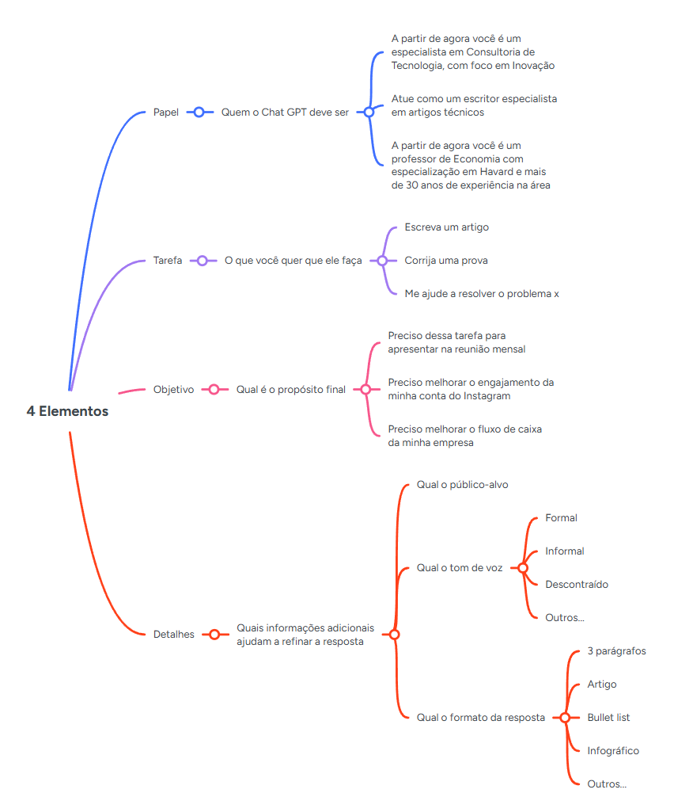
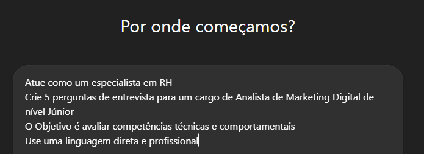

# Os 4 Elementos de Um Bom Prompt




## Papel – Quem o Chat GPT deve ser

- A partir de agora você é um especialista em Consultoria de Tecnologia, com foco em Inovação
- Atue como um escritor especialista em artigos técnicos
- A partir de agora você é um professor de Economia com especialização em Havard e mais de 30 anos de experiência na área

## Tarefa – O que você quer que ele faça

- Escreva um artigo
- Corrija uma prova
- Me ajude a resolver o problema x

## Objetivo – Qual é o propósito final

- Preciso dessa tarefa para apresentar na reunião mensal
- Preciso melhorar o engajamento da minha conta do Instagram
- Preciso melhorar o fluxo de caixa da minha empresa

## Detalhes – Quais informações adicionais ajudam a refinar a resposta

- Qual o público-alvo
- Qual o tom de voz
  - Formal
  - Informal
  - Descontraído
  - Outros...
- Qual o formato da resposta
  - 3 parágrafos
  - Artigo
  - Bullet list
  - Infográfico
  - Outros...

# Exemplos

```
Atue como um especialista em RH
Crie 5 perguntas de entrevista para um cargo de Analista de Marketing Digital de nível Júnior
O Objetivo é avaliar competências técnicas e comportamentais
Use uma linguagem direta e profissional
```



**Resposta do GPT**

Claro! Aqui estão 5 perguntas de entrevista para o cargo de Analista de Marketing Digital – Júnior, focadas em competências técnicas e comportamentais, com linguagem direta e profissional:

1️⃣ Competência Técnica – Estratégia e Execução
“Quais canais de marketing digital você já utilizou (ex.: redes sociais, e-mail, tráfego pago)? Descreva uma ação que você executou e os resultados obtidos.”

🎯 Avalia: Vivência prática, entendimento de canais e capacidade de mensurar resultados.

2️⃣ Competência Técnica – Métricas e Análise
“Quais métricas você considera essenciais para avaliar o desempenho de uma campanha digital e por quê?”

🎯 Avalia: Conhecimento em KPIs (CTR, CPC, CPA, ROI, taxa de conversão etc.) e raciocínio analítico.

3️⃣ Competência Técnica – Ferramentas
“Com quais ferramentas de marketing digital você já teve contato (ex.: Google Ads, Meta Ads, Google Analytics, RD Station)? Como você as utilizou?”

🎯 Avalia: Familiaridade com ferramentas e capacidade operacional.

4️⃣ Competência Comportamental – Resolução de Problemas
“Conte sobre uma situação em que uma campanha ou atividade não apresentou o resultado esperado. Como você analisou e o que fez para ajustar?”

🎯 Avalia: Pensamento crítico, proatividade e capacidade de adaptação.

5️⃣ Competência Comportamental – Organização e Prioridades
“Como você organiza suas tarefas quando precisa lidar com múltiplas demandas e prazos curtos?”

🎯 Avalia: Gestão do tempo, priorização e disciplina.
