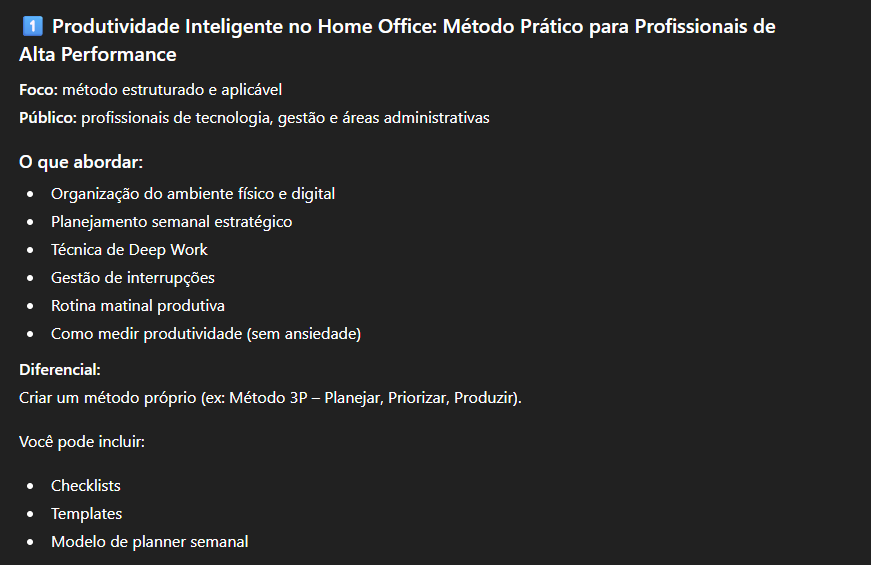
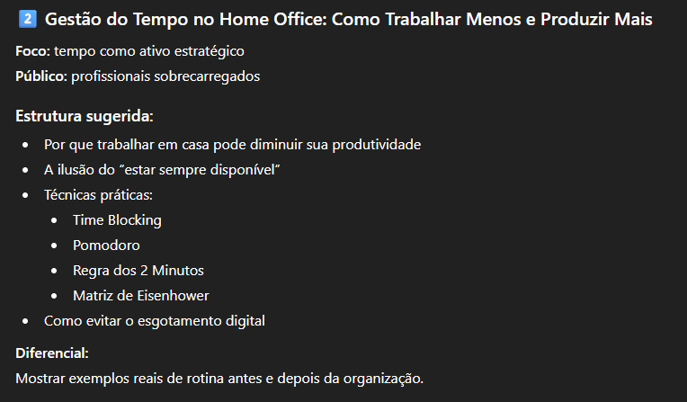
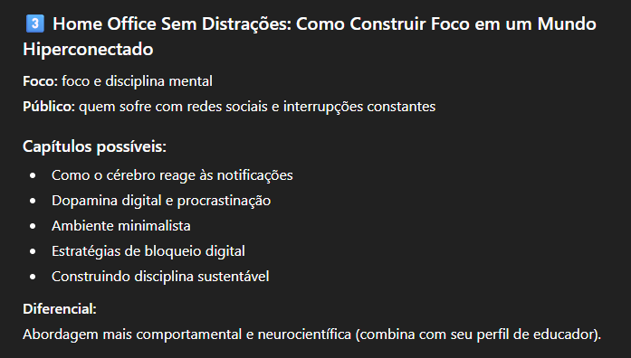
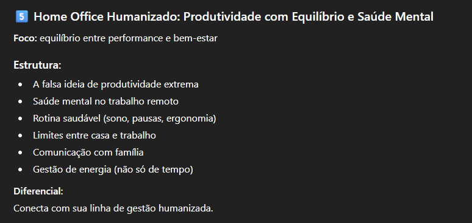
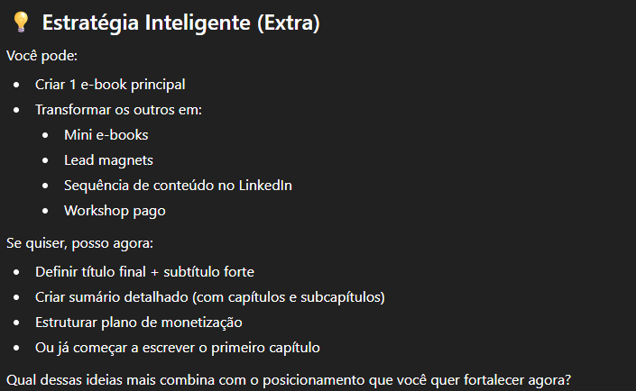
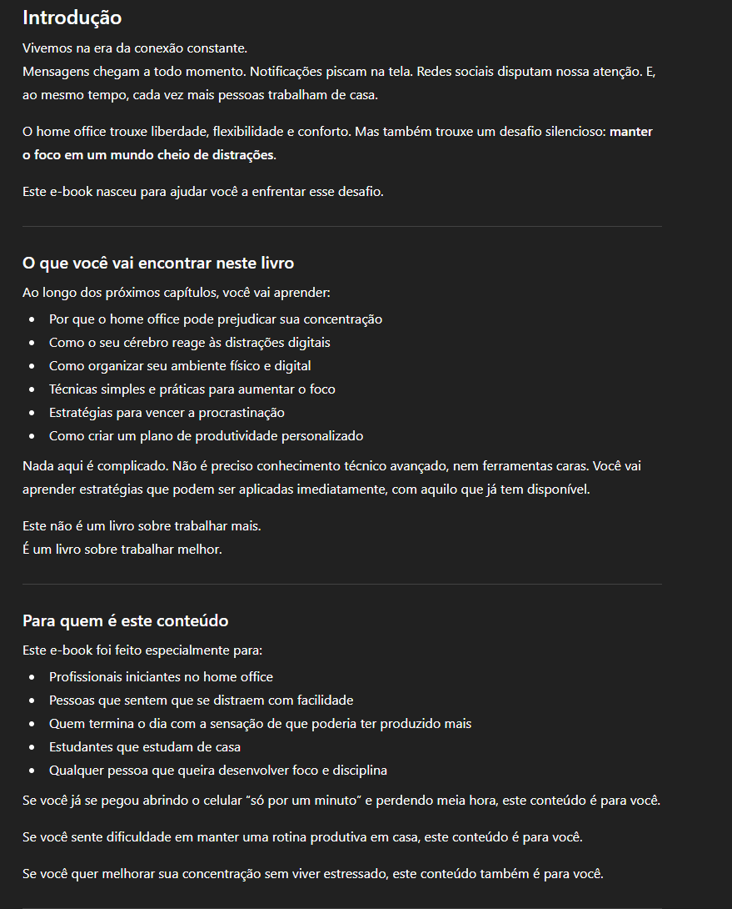
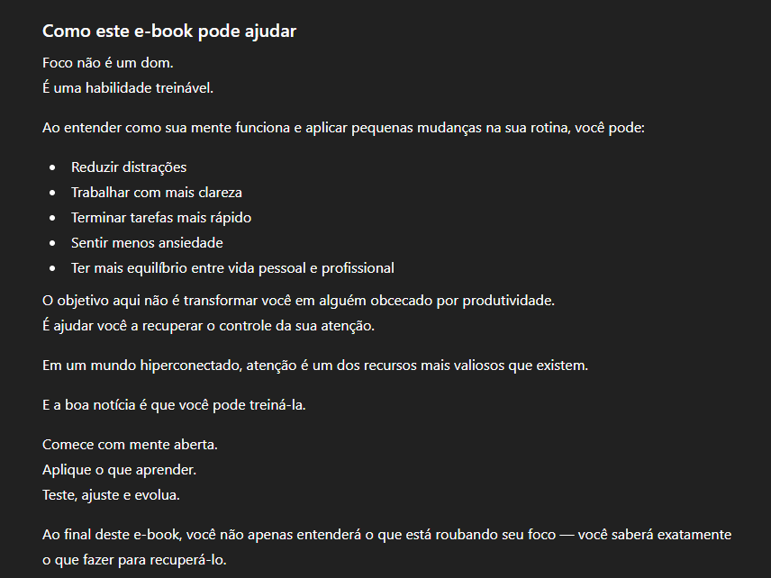

# Estudo de Caso - e-Book

## Etapa 1 - Geração da Ideia

```
Sugira 5 ideias de e-book para ajudar profissionais que trabalham home office a melhorar sua produtividade!
```

#### Resposta para esse prompt












## Etapa 2 - Estruturação do Indice

```
Crie um indice para um e-book chamado "Home Office Sem Distrações: Como Construir Foco em um Mundo Hiperconectado", voltado para iniciantes!
```

#### Resposta para esse prompt

Como o público é iniciante, o índice precisa ser:

- Progressivo (do básico ao avançado)
- Didático
- Simples de aplicar
- Sem termos excessivamente técnicos
- Com exercícios práticos

Aqui está um índice estruturado, pedagógico e comercialmente forte:

### Home Office Sem Distrações - Como Construir Foco em um Mundo Hiperconectado

##### Apresentação

- Por que escrevi este e-book
- Para quem este livro é
- Como usar este material da melhor forma

##### Capítulo 1 — O Desafio do Home Office

- O que mudou no mundo do trabalho
- As principais dificuldades de quem está começando
- A ilusão da multitarefa
- O verdadeiro custo das distrações

##### Capítulo 2 — Entendendo Como Seu Cérebro Funciona

- O que é atenção
- Por que notificações nos distraem
- O papel da dopamina
- Como o excesso de informação afeta sua produtividade

##### Capítulo 3 — Organizando Seu Ambiente de Trabalho

- Criando um espaço produtivo em casa
- Iluminação, postura e conforto
- Reduzindo distrações físicas
- Organização digital básica (arquivos, desktop e apps)

##### Capítulo 4 — Construindo uma Rotina Produtiva

- A importância de horários definidos
- Planejamento diário simples
- Planejamento semanal para iniciantes
- Separando vida pessoal e trabalho

##### Capítulo 5 — Técnicas Simples de Foco para Começar Hoje

- Técnica Pomodoro passo a passo
- Regra dos 2 minutos
- Lista de 3 prioridades do dia
- Trabalhando em blocos de tempo

##### Capítulo 6 — Como Lidar com Distrações Digitais

- Organizando notificações
- Uso consciente das redes sociais
- Aplicativos que ajudam a manter o foco
- Criando limites saudáveis

##### Capítulo 7 — Vencendo a Procrastinação

- Por que procrastinamos
- Pequenos passos que destravam a ação
- Como criar disciplina sem sofrimento
- O poder dos micro-hábitos

##### Capítulo 8 — Criando Seu Plano de Foco Pessoal

- Autoavaliação de produtividade
- Identificando suas principais distrações
- Definindo metas realistas
- Plano de 7 dias para começar

##### Conclusão

- O foco como habilidade treinável
- Pequenas melhorias diárias
- Próximos passos

##### Bônus

- Checklist diário de foco
- Modelo de planejamento semanal
- Lista de ferramentas recomendadas

## Etapa 3 - Desenvolvimento do Conteúdo

- Introdução
- Título e Subtítulo
- Conclusão

```
Você é um redator de conteúdos educacionais. Escreva o capítulo de 1 a 8 do ebook, com linguagem simples, tom motivacional e exemplos práticos!
```

A resposta deste prompt está no link -> https://chatgpt.com/share/69a099cb-daec-800f-8970-72546f49242e

## Etapa 4 - Geração de Elementos

```
Crie uma introdução para o e-book explicando o que será abordado, para quem é o conteúdo e como ele pode ajudar.
```





```
Sugira 5 títulos chamativos para o e-book e subtítulos explicativos com até 20 paalvras
```

Escolha a opção que mais lhe agradou.

```
Gostei da opção 3
Escreva uma concluusão com tom inspirador, incentivando o leitor a aplicar o que aprendeu
```

## Etapa 5 - Revisão e Adaptação Final

```
Revise todo o conteúdo do e-book e melhore a fluidez dos textos. Remova repetições e melhore a transição entre os capítulos. Não precisa me mostrar essa parte, pule para a geração do PDF, inclua capa, índice e todo o conteúdo!
```

Vamos refinar o que ele gerou:

```
No pdf os 8 capítulos ficaram incompletos, revise novamente com base nas ideias de capítulos que me sugeriu acima!
```
